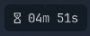
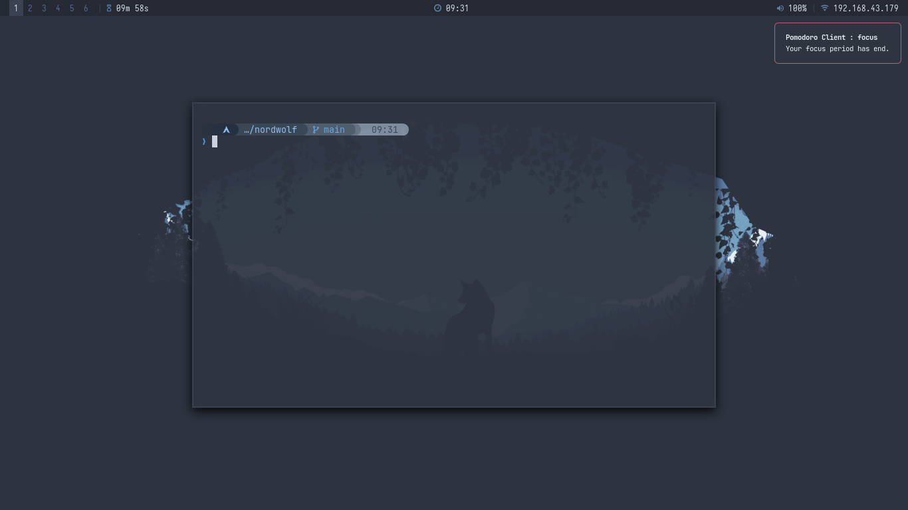
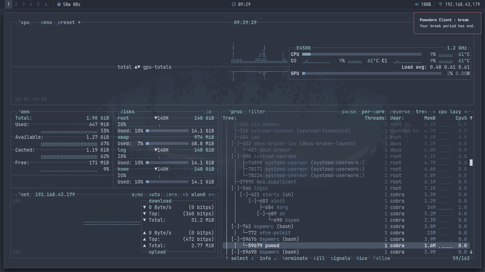
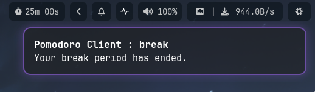

# pomoc 

**This is how the final result looks like :**

| Mode:       | *In polybar:* | *In waybar:* |
|-------------|-------------|------------|
*In Idle*|||
*In Running*|||
*In Paused*|||
*In Break*|||

*Pomoc running in a few variations of waybar w/ unique themes*


This is the integration of the **pomoc** with polybar and waybar. In addition to the daemon and client, I have used 2 additional scripts for formatting the output. That's it. Now, I shall be able to see the timer.

## It is 

**What this is about :**
`pomoc` is a simple pomodoro for unix based systems, which uses **unix sockets** for communication between the **client** : `pomoc` and the **daemon** : `pomod`. This is part of my C learning program, specifically, unix sockets and project structure. 

**Why did I create this?**
Because I was in the need for creating it. I wanted to integrate a productive pomodoro, that is not bloated like with GUI. I am a maximal terminal guy who spends the time mostly learning or reading books in zathura and programming in neovim. I need to keep track of my time, and that's why this was born. Apart from that, this project is just a learning phase. 

**What is special about this?**

It is simply just terminal based. It is a daemon. The daemon process is the `pomod` (pomodoro daemon) and you communicate commands and start, stop or modify the timer via `pomoc` (pomodoro client). As this is also for a learning phase, I have included write ups in the **docs** directory.

Uses the unix philosophy. Does one thing, does that thing right. And it does - keeps track of time. I have baked in a set of commands in this client so that it is scriptable and easily able to integrate with bar systems and other programs (that is, `pomoc` acts as an IPC).

You will be able to keep track of your learning or workflow, the time spend by using `pomoc`, `task`, `taskwarrior-tui` and some bar like `polybar`. That's it. No heavy GUI, No bloated window occupying space.

## Installation

**To install from source (for non arch systems) :**

```bash
make
```

Binaries land at `build/bin/pomod` and `build/bin/pomoc`. You can either symlink them to some directory which is in `$PATH`, or just copy it to `~/.local/bin` or `/usr/bin` for user or systemwide binaries respectively. 


**To install via makepkg (for arch systems) :**

```bash
makepkg -si
```

This installs `pomod` and `pomoc` to `/usr/bin/`.

**For uninstalling the package :**

If you use arch based distro and installed it via `makepkg`, it is just using `pacman` uninstall.

```bash
sudo pacman -Rns pomoc
```

>[!NOTE]
> `pomoc` is the name of package that is installed in the system. It comes with **two binaries** - `pomoc`, which is the client and `pomod` which is the daemon. When you remove it with `sudo pacman -Rns pomoc`, it removes it as a package - that is both `pomoc` and `pomod` binaries are removed.

## Setup

Create the config file:

```bash
mkdir -p ~/.config/pomoc
nvim ~/.config/pomoc/config.ini
```

Of course, you can use the editor of your choice to edit the configuration.
Note, that the config is not immune to whitespaces. It should be how it is. You just configure these two. That's it. 


```ini
# focus time hr:min:sec
focus = 00:25:00

# break time min:sec
break = 05:00
```

If no config file is found, defaults are used: focus `25:00`, break `5:00`.

## Starting the Daemon

`pomod` must be running before any `pomoc` command works. As stated, pomod is the pomodoro daemon, wheras, the pomoc is the pomodoro client. 

```bash
pomod
```

To run it in the background:
```bash
pomod &
```

To stop it:
```bash
pkill pomod
```

## Commands

The below given table will **teach** you how to use this tool. I have also included some useful scripts in the end to make it easy for the users (you ppl) to integrate into other programs and bars. 

### Control

| Command | Description |
|---|---|
| `pomoc start` | Start or resume focus timer |
| `pomoc pause` | Pause focus timer |
| `pomoc toggle` | Toggle between pause and resume/start |
| `pomoc end` | End focus early, triggers break immediately |

### Status

| Command | Output |
|---|---|
| `pomoc status` | Full status: state, phase, remaining time |
| `pomoc status state` | Current State : `paused`, `running`, `break`, `idle`|
| `pomoc status active` | Active phase: `focus` or `break` |
| `pomoc status time` | Remaining time formatted |
| `pomoc status hr` | Remaining hours (raw) |
| `pomoc status min` | Remaining minutes (raw) |
| `pomoc status sec` | Remaining seconds (raw) |

### Config (only when not running)

| Command | Description |
|---|---|
| `pomoc focus hr:min:sec` | Set focus time |
| `pomoc break min:sec` | Set break time |
| `pomoc focus hr +N` | Increment/decrement focus hours |
| `pomoc focus min +N` | Increment/decrement focus minutes |
| `pomoc focus sec +N` | Increment/decrement focus seconds |
| `pomoc break min +N` | Increment/decrement break minutes |
| `pomoc break sec +N` | Increment/decrement break seconds |

>[!WARNING]
> You can now update the **focus** timer's value midway while the focus is in progress by : pausing it via `pomoc pause`, then updating the value via `pomoc focus hr/min/sec +/-N`, then resume the timer `pomoc start`. But note that **you cannot pause the break** midway while its running. You can update the break before it starts via `pomoc break min/sec +/-N`. You are not supposed to have break for hours.

### Rules

- Break is **mandatory** — cannot be paused, skipped, or ended. This is because : **you need to touch some grass**. 
- Config changes are **blocked** while focus or break is running. 
- Config changes **are allowed** while paused. 
- Once break ends, timer returns to idle with focus config reloaded.


## Time Format

`pomoc status` and `pomoc status time` display time as:
- `hr:min:sec` if hours are non-zero → `01:24:37`
- `min:sec` if hours are zero → `24:37`

Raw field queries (`hr`, `min`, `sec`) will always return the value as-is with zero padding → `00`, `05`, `37`.

## Example Session

So, power up your terminal and try this tool. I use alacritty btw. 

```bash
# start daemon
pomod &

# set a 45 minute focus session
pomoc focus 00:45:00

# add 5 more minutes
pomoc focus min +5

# start
pomoc start

# toggle 
pomoc toggle

# check status
pomoc status
# → paused focus 49:42

# toggle again
pomoc toggle

pomoc status state
# → running

# check time only
pomoc status time
# → 49:42

# pause
pomoc pause

# resume
pomoc start

# end focus early
pomoc end
# → break starts automatically

# check break status
pomoc status
# → break break 04:58

# after break ends, back to idle
pomoc status
# → idle focus 50:00
```


## Statusbar Integration

Since `pomoc status time` and `pomoc status active` print clean single-line output, you can use them directly in waybar, i3blocks, polybar or any statusbar:

```bash
# example shell script for statusbar
echo "$(pomoc status active) — $(pomoc status time)"
# → focus — 24:37
```

### polybar 

Create the following modules in the `modules.ini` file. I use `paplay` to play the alarm sound for 5 seconds as the focus/break ends, and send a critical notification with timeout so that it is also visible to me in case I am deaf. 

```ini
[module/pomoc]
type = custom/script
exec = /path/to/pomoc.sh
interval = 1

format = <label>

label = "%output%"
click-left  = /path/to/pomoc-toggle.sh
;; or if you have the pomoc toggle functionality (see PKGBUILD pkgver=1.0.1)
;; then you can use the below given as an alternative for pomoc-toggle.sh
;; click-left = pomoc toggle
click-right = pomoc end

```

We can also indicate the status of the pomodoro, whether it is paused, running, idle or in break. This comes with the new functionality `pomoc status state` in the update (see [PKGBUILD](./PKGBUILD)) version `1.0.2`. Suppose we need to indicate the state of the pomodoro with glyphs, we need a separate module : `pomoc-state`, which is as given below.

```ini
[module/pomoc-state]
type = custom/script
exec = /path/to/pomoc-state.sh
interval = 0.5
format = <label>
format-foreground = ${color.BLUE}

label = "%output% "
click-left  = pomoc toggle
click-right = pomoc end
```


>[!NOTE]
> Make sure to replace that `format-foreground = ${color.BLUE}` in the `pomoc-state` module to a valid color as per your polybar configuration.

For this integration to work properly - You need to 

1) Have a config file in '~/.config/pomoc/config.ini' with parameters set before you can start the daemon. (`pomod`)
2) Start the daemon `pomod` to make the output visible in the polybar.
3) Start the pomodoro using the client `pomoc` via :

```bash
pomoc start
```

4) See the timer running. Finally, touch some grass during the break.

In this modules, you click (left) to start or pause the pomodoro.
And right click to skip the pomodoro and move to break. 
You cannot skip the break.

>[!IMPORTANT]
> Without the following scripts, the module will not work. Make sure to change the `/path/to/<script>` to the actual path where you want to keep the script. And also make sure to make it executable via `chmod +x <script>`

**pomoc.sh**


```bash
#!/bin/bash

result=$(pomoc status time 2>/dev/null)
active=$(pomoc status active 2>/dev/null)
if [[ ! "$result" ]]; then
    echo ""
else
    echo "$result" | grep -qP "^\d{2}:\d{2}:\d{2}" &&
        echo "$result" | sed 's/\([0-9]*\):\([0-9]*\):\([0-9]*\)/\1h \2m \3s/' ||
        echo "$result" | sed 's/\([0-9]*\):\([0-9]*\)/\1m \2s/'

    if [[ "$result" == "00:00" || "$result" = "00:00:00" ]]; then
        notify-send "Pomodoro Client : $active" "Your $active period has end." -u "critical" -t "5000" &
        timeout 5 paplay /usr/share/sounds/freedesktop/stereo/alarm-clock-elapsed.oga &
    fi
fi
```


The above given script will send notification spanning 5 seconds : which gives you a visual feedback that the focus has end, or the break has end. **If you really want a break, want a more efficient way out of the computer, trigger your screen lock** by modifiying the script.

*Focus ends*



*Break ends*



*Break ends - Waybar variant (Using `swaync`)*



**pomoc-toggle.sh**


```bash
#!/bin/bash

active="$(pomoc status active)"

if [[ "$active" == "idle" || "$(cat /tmp/polyline.pomoc.state)" == "pause" ]]; then
    pomoc start
    echo "focus" >/tmp/polyline.pomoc.state
elif [[ "$(cat /tmp/polyline.pomoc.state)" == "focus" ]]; then
    pomoc pause
    echo "pause" >/tmp/polyline.pomoc.state
fi

[[ "$active" == "break" ]] && echo "break" >/tmp/polyline.pomoc.state
```


**pomoc-state.sh**


```bash
#!/bin/bash

state="$(pomoc status state)"

case "$state" in
    idle) echo "󱎫" ;;
    running) echo "󰥔" ;;
    paused) echo "󰥕" ;;
    break) echo "󰔟" ;;
    *) echo "?" ;;
esac
```

### waybar

Open your waybar config, and place the following inside:
```
            "group/pomoc": {
                "orientation": "inherit",
                "modules": [
                    "custom/pomoc-state",
                    "custom/pomoc",
                ]
            },

            "custom/pomoc": {
              "exec": "bash /path/to/pomoc.sh",
              "interval": 1,

              "format": "{}",

              "on-click": "bash -c '/path/to/pomoc toggle'",
              "on-click-right": "bash -c '/path/to/pomoc end'",
            },

            "custom/pomoc-state": {
              "exec": "bash /path/to/pomoc-state.sh",
              "interval": 1,

              "format": "{} ",

              "on-click": "bash -c '/path/to/pomoc toggle'",
              "on-click-right": "bash -c '/path/to/pomoc end'"
            },
```

> [!IMPORTANT]
> Make sure to replace all instances of `/path/to/` with the appropriate path for your system.

Then, declare the pomoc group itself in `"modules-left": []`, `"modules-center": []`, or `"modules-right: []` \
somewhere in your configuration (*likely at the top*) to actually display it.

Finally, start the daemon with `/path/to/pomod &` (or just `pomod &` if you have the Arch pkg), and you're good to go!

> [!TIP]
> All prior commands demonstrated work in the waybar version as well :)

**Watch out or pull request for other bar integrations.**

>[!NOTE]
> If you want to learn C, know the plan, build similar projects - you can see in the **[docs](./docs)** directory. Start with **[plan.md](./docs/plan.md)**

> [!NOTE]
> For additional tips, or if you are willing to suggest some scripts, go to **[tips.md](./docs/tips.md)**
